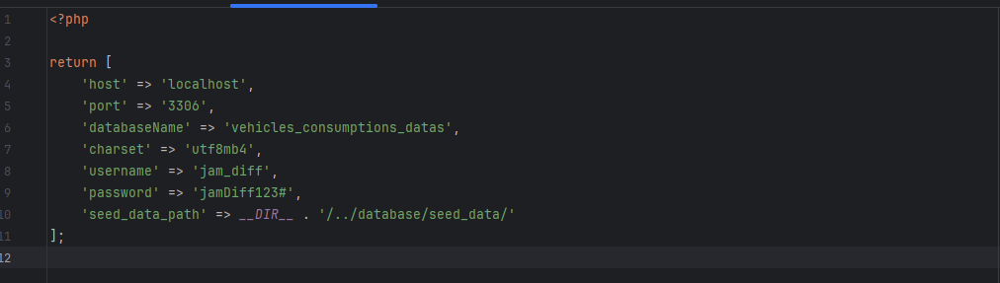
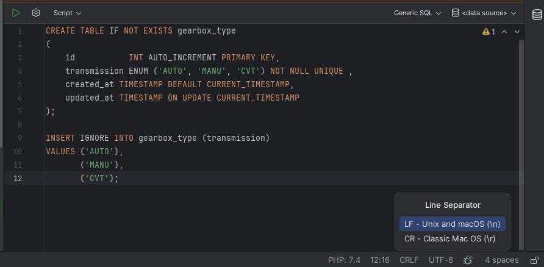

## Consommation des véhicules jusqu'à 2009

Permet de consulter les données de consommation en carburant et la classe énergétique d'environ 8500 modèles du parc automobile mondial.
Recherche multi critères (Marque, type d'énergie, classe énergétique, type de transmission).
Possibilité de supprimer une entrée de la base.

**Stack :**
- PHP 7.4
- Composer 1.10.27
- PhpQuery 0.9.7
- Bootstrap 5
- JQuery 3.7.1

**Déploiement de l'application :**

1. Créer une base de données MariaDB nommée : `vehicles_consumptions_datas`
2. Créer un utilisateur de la base de données :
    - username: `jam_diff`
    - password : `jamDiff123#`
3. Dans le fichier `config/database.php`, renseigner le *host* (par défaut `localhost`) et le *port* (par défaut `3306`).


4. Installer les dépendances avec composer : 
   ```bash
   php composer.phar install 

5. Bien vérifier que l'encodage du *line separator* n'ait pas été modifié, exemple en **CRLF** (windows) au lieu de **LF** (Unix) par un éditeur ou par Windows si déploiement sous Windows sur les fichiers tous les fichiers **.sql** présents dans le dossier *projet/databases/seed_data/* sinon il y aura une erreur de syntax lors de l'exécution des scripts. 
Exemple :


6. Lancer le serveur natif PHP par la commande :
   ```bash
   php -S localhost:8000 -t public

7. Accéder à l'URL suivante pour créer les tables et peupler la base :
   ```bash
   http://localhost:8000/seed 

8. Aller à l'URL suivante pour utiliser l'application :
   ```bash
   http://localhost:8000 
